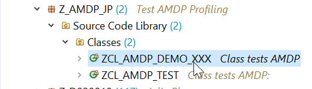
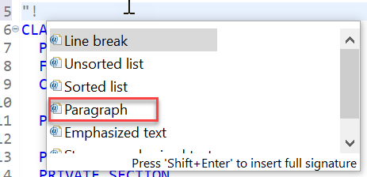
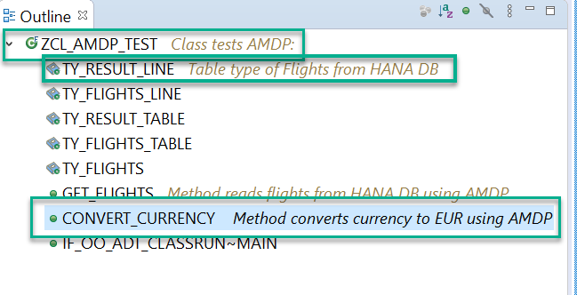

## Details
### You will learn  
- How to maintain ABAPDoc comments
- How to synchronize comments so they appear in the Outline View
- How to add an sorted list
- How to create a link to other development object documentation within ADT

ABAPDoc comments are used to document your code. This makes it more readable. If other developers use one of your development objects, they can find out more about it by selecting the object name in the code and choosing **Element Info ( `F2` )**.

All ABAPDoc comments begin with **`"!`**.

Always replace `XXX` with your initials or group number.

---

[ACCORDION-BEGIN [Step 1: ](Open ABAP class)]
First, open the ABAP class **`ZCL_AMDP_DEMO_XXX`** from the tutorial [Create an AMDP and Analyze Its Performance](abap-environment-amdp-profiling)

!

[DONE]
[ACCORDION-END]


[ACCORDION-BEGIN [Step 2: ](Create ABAPDoc comment)]
1. Immediately before the class definition, add an ABAPDoc comment to the class by entering **`"!`** and choosing **Auto-complete ( `Ctrl+Space` )**.

2. From the dropdown list, choose **Paragraph**, then add the following comment:

    **`"!<p>Class tests AMDP</p>`**

    !

    >You must insert the ABAPDoc comment **immediately** before the declaration; otherwise you will get a warning from ADT.

3. Add the following to the paragraph ( `<p>` ) tag: **`class="shorttext synchronized"`**, so your code looks like this:

    ```
    "!<p class="shorttext synchronized">Class tests AMDP: </p>
    ```

4. Add the following comments to the table type **`ty_result_line`** and to the method **`GET_FLIGHTS`** respectively:

    ```
    "!<p class="shorttext synchronized">Table type of Flights from HANA DB</p>
    "! <p class="shorttext synchronized"> Method reads flights from HANA DB using AMDP</p>
    ```

5. Save and activate your class.

The comments should now appear in the Outline View:

!

[DONE]
[ACCORDION-END]


---
