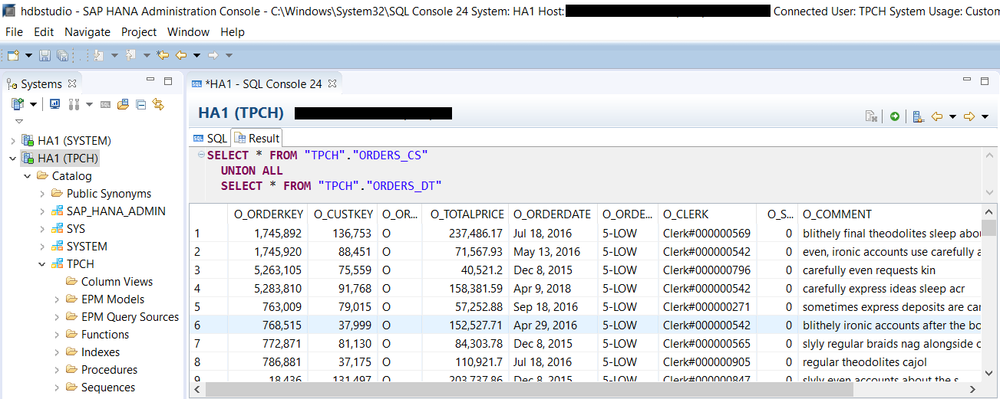
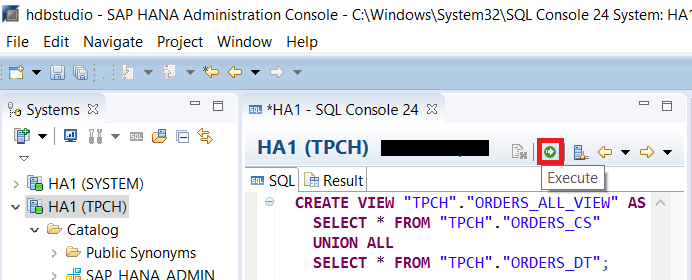
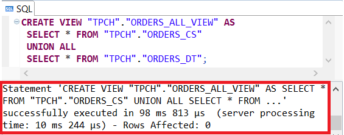
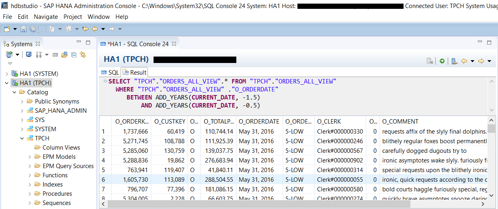

## Prerequisites
 - **Proficiency:** Beginner
 - **Tutorials:** [Migrate Records in Related Tables Using Stored Procedure](https://developers.sap.com/tutorials/dt-create-schema-load-data-part6.html)

## Next Steps
 - **Tutorials:** [Multi-Store Tables](https://developers.sap.com/tutorials/dt-create-schema-load-data-part8.html)

## Details
### You will learn
 - Viewing the combined data set for data partitioned between an in-memory and a Dynamic Tiering table instance.
 - Creating and using a SQL view.
 - Querying against a SQL view with conditions.

### Time to Complete
**5 Min**.

---

[ACCORDION-BEGIN [Step 1: ](Query From Both In-Memory and Dynamic Tiering Tables)]
You may have many cases where you only need to access data either from the in-memory table instance (`ORDERS_CS`) or from the Dynamic Tiering table instance (`ORDERS_DT`). However you will also likely have use cases where you need to query the full data set across both table instances, which can be done with a union.
Run the script below in a SQL Console to query data from both in-memory and Dynamic Tiering tables using a `UNION`.

```sql
SELECT * FROM "TPCH"."ORDERS_CS"
UNION ALL
SELECT * FROM "TPCH"."ORDERS_DT"
```
>Note: Since we are explicitly managing the data set between `ORDERS_CS` and `ORDERS_DT` to ensure that data is not duplicated between the 2 tables, we can use the `UNION ALL` variation of the `UNION` clause, which is faster because it doesn't eliminate duplicate records in the combined result set.



[DONE]

[ACCORDION-END]

[ACCORDION-BEGIN [Step 2: ](Create and Query against a SQL View)]
Alternatively you can create an SQL view to query data from multiple tables and simplify the process. Run the script below to create a SQL view.

```sql
CREATE VIEW "TPCH"."ORDERS_ALL_VIEW" AS
  SELECT * FROM "TPCH"."ORDERS_CS"
  UNION ALL
  SELECT * FROM "TPCH"."ORDERS_DT";
```



Verify the script executed correctly.



After successfully creating a view, you can query against the `"TPCH"."ORDERS_ALL_VIEW"` whenever you need to access the combined data set. For example, if you want to query order records that are between 6 months and 18 months old, you can execute the query below.

```sql
SELECT "TPCH"."ORDERS_ALL_VIEW".* FROM "TPCH"."ORDERS_ALL_VIEW"
    WHERE "TPCH"."ORDERS_ALL_VIEW" ."O_ORDERDATE"
      BETWEEN ADD_YEARS(CURRENT_DATE, -1.5)
          AND ADD_YEARS(CURRENT_DATE, -0.5)
```




[ACCORDION-END]
