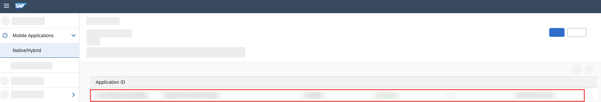
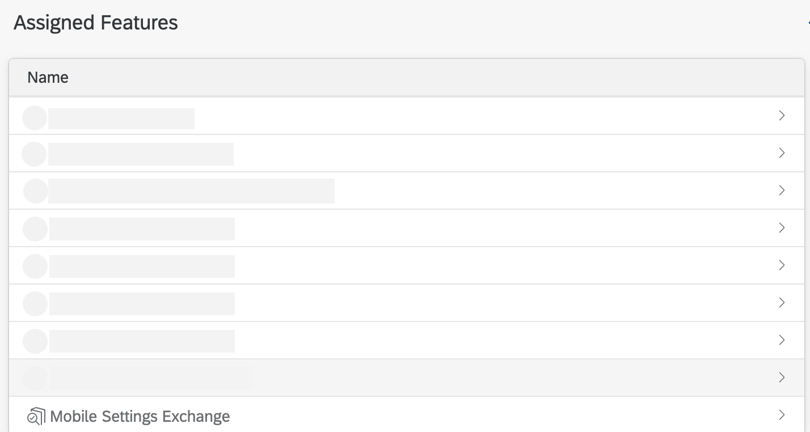
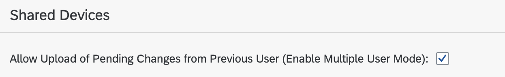

## Prerequisites
- You have [Set Up a BTP Account for Tutorials](group.btp-setup). Follow the instructions to get an account, and then to set up entitlements and service instances for the following BTP services.
    - **SAP Mobile Services**
- You have [created your first application with SAP BTP SDK for iOS](group.ios-sdk-setup).

## Details
### You will learn
- How to create a native iOS application that supports multiple users on the same device
- How to modify the SAP BTP SDK for iOS assistant generated application

---

[ACCORDION-BEGIN [Step 1: ](The real world use case)]
An air carrier organisation uses an iOS application built using SAP BTP SDK for iOS to keep a track of an aircraft's vital information (Fuel Level, Tyre Pressure, etc.) before each flight. The application must support offline use-case to comply with the network regulations at the airport. Since the airline has flights departing round the clock, it deploys ground staff in three 8-hour shifts. To maximise efficiency, the organisation wants ground staff to share mobile devices.

The ground staff members want a solution that is reliable even in the absence of network. They also aren't keen on logging out and logging in every time a shift ends, as they believe this could lead to erroneous data.

In this tutorial, you will learn how to enhance your [SAP BTP SDK for iOS Assistant](https://developers.sap.com/trials-downloads.html?search=SAP+BTP+SDK+for+iOS) generated application to create an offline enabled application that supports multiple users.

[DONE]
[ACCORDION-END]

[ACCORDION-BEGIN [Step 2: ](Enable multi-user mode in mobile services cockpit)]

1. In your mobile services account, click Mobile Applications &rarr; Native/Hybrid &rarr; **<Your Mobile Application configuration>**.

    

2. Under Assigned Features, click **Mobile Settings Exchange**.

    

    > Assigned features can be found under the Info tab.

3. Under Shared Devices section, enable the *Allow Upload of Pending Changes from Previous User (Enable Multiple User Mode):* checkbox.

    

    > You must enable this checkbox if you are building an offline capable multi-user application.

[ACCORDION-END]

---
