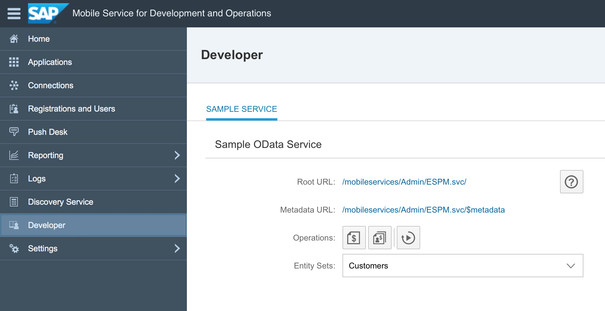

## Prerequisites  
 - **Development environment:** Apple iMac, MacBook or MacBook Pro running Xcode 9 or higher
 - **SAP BTP SDK for iOS:** Version 2.0

## Details
### You will learn  
  - How to access the sample OData service that comes with the SAP Mobile Services for development and operations
  - How to generate sample data for use in your application

---

A sample OData service is available for developers to use during development and testing. Administrators can configure the sample service via the cockpit. You can view the root service and metadata URLs, and generate sample sales orders and purchase orders for multiple entity sets. You can also view the data for each entity in a separate text file, and reset the sample data.

> You can configure **only one** sample OData service per tenant.

The following roles are required to use this service:

| Role | Service URL | Description
|---|---|---|
| Developer | `<JAVA application URL>/mobileservices/SampleServices/ESPM.svc/` | Access the sample OData service |
| Administrator | `/mobileservices/Admin/ESPM.svc/` | Administrators configure an application in the cockpit to enable the service for the developer |

[ACCORDION-BEGIN [Step 1: ](Open Developer tab)]

In SAP Mobile Services for development and operations cockpit, navigate to **Developer**.

[DONE]
[ACCORDION-END]

For now, this complements this tutorial step. In the following tutorials, you will actually query the OData service and display the results.

[VALIDATE_9]
[ACCORDION-END]
