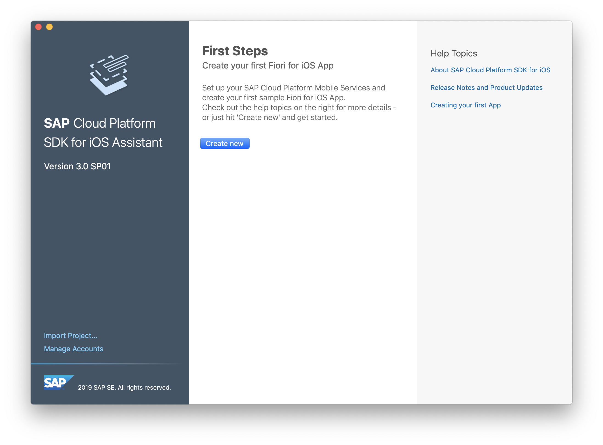
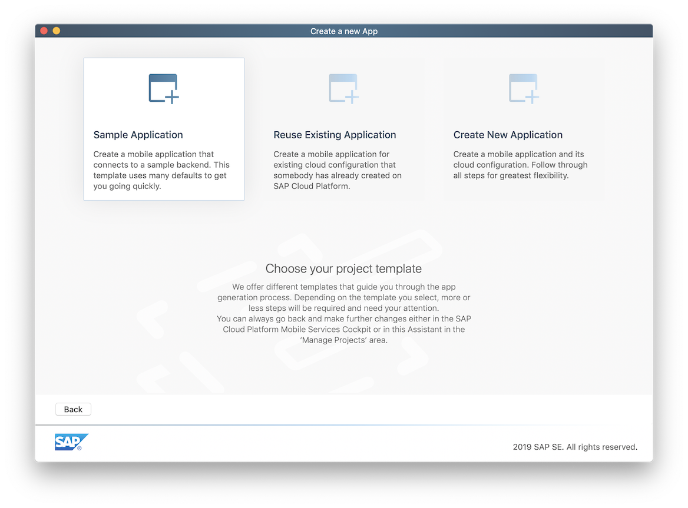
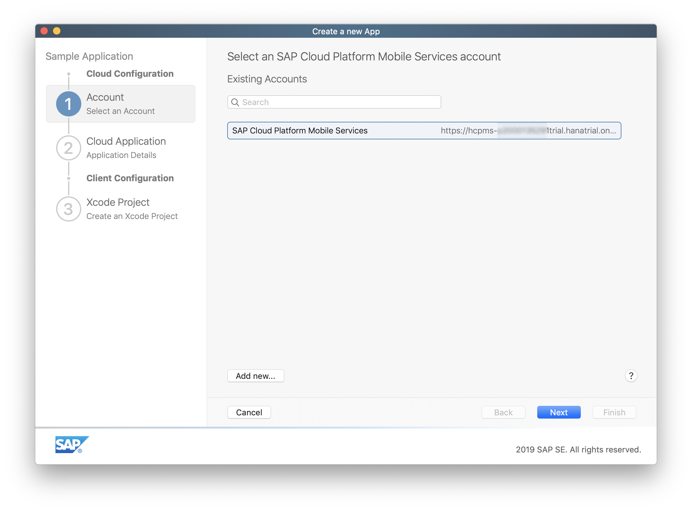
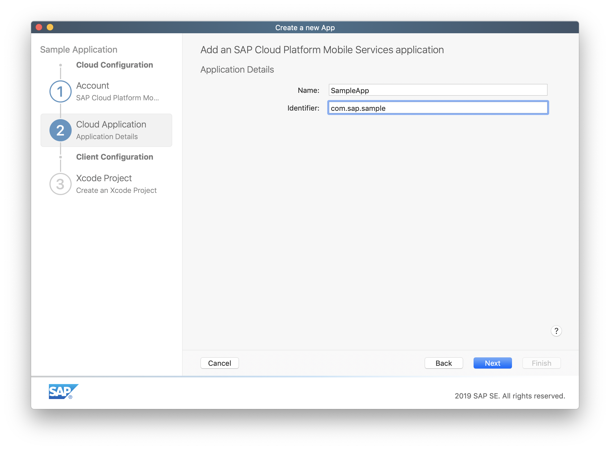
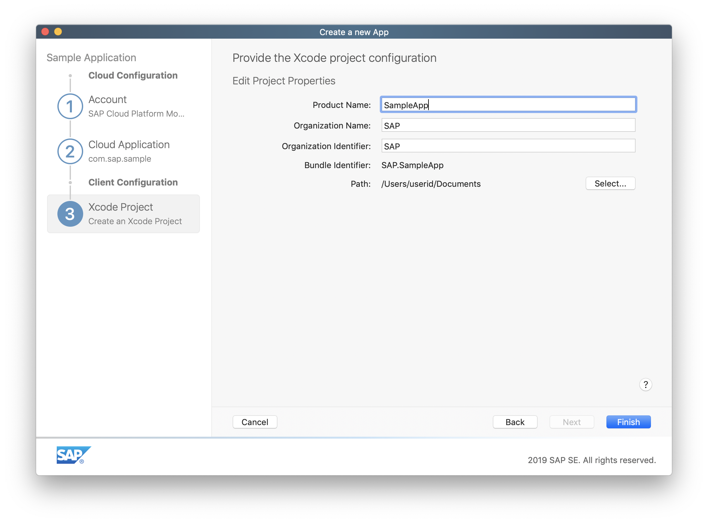

## Prerequisites  

- [Configure Mobile Services in the Assistant](hcp-create-trial-account)

## Details

### You will learn  

- In this tutorial, you will create your first iOS app using SAP BTP SDK Assistant for iOS.

>The SAP BTP SDK Assistant for iOS (SAP BTP SDK Assistant for iOS) is a macOS application that helps developing iOS applications which use the SAP BTP SDK for iOS frameworks. It speeds up development by generate code for accessing OData services, define authentication mechanism, enable remote push notifications and add logging statements.

---

[ACCORDION-BEGIN [Step 1: ](Run the SAP BTP SDK Assistant for iOS)]

Double-click the **SAP BTP SDK Assistant for iOS** icon to start the application. If no applications have been generated previously, you will see the initial screen.

[DONE]
[ACCORDION-END]

[ACCORDION-BEGIN [Step 2: ](Create an Xcode Project)]

Click the **Sample Application** to create a mobile application that connects to a sample backend.

>The first step of the workflow asks you to choose whether to create a sample app, use an existing cloud app configuration, or create a new one.

Select SAP Mobile Services account you added in previous tutorial and click **Next**.

Provide application details to add application to SAP Mobile Services.

Enter the following details:

| Field | Value |
|----|----|
| Name | `SampleApp` |
| Identifier | `com.sap.sample` |

Provide the Xcode project configuration and click **Finish**.

| Field | Value |
|----|----|
| Product Name | `SampleApp` |
| Organization Name | `<your company name>` |
| Organization Identifier | `<a unique identifier>` |
| Path | `<choose a local destination>` |

[DONE]
[ACCORDION-END]

>A user registration is a unique combination of Registration ID, User Name, Application ID and Device Type.

[DONE]
[ACCORDION-END]
