## Prerequisites  

- [Configure Mobile Services in the Assistant](hcp-create-trial-account)

## Details

### You will learn  

- In this tutorial, you will create your first iOS app using SAP BTP SDK Assistant for iOS.

>The SAP BTP SDK Assistant for iOS (SAP BTP SDK Assistant for iOS) is a macOS application that helps developing iOS applications which use the SAP BTP SDK for iOS frameworks. It speeds up development by generate code for accessing OData services, define authentication mechanism, enable remote push notifications and add logging statements.

---

[ACCORDION-BEGIN [Step 1: ](Run the SAP BTP SDK Assistant for iOS)]

Double-click the **SAP BTP SDK Assistant for iOS** icon to start the application. If no applications have been generated previously, you will see the initial screen.

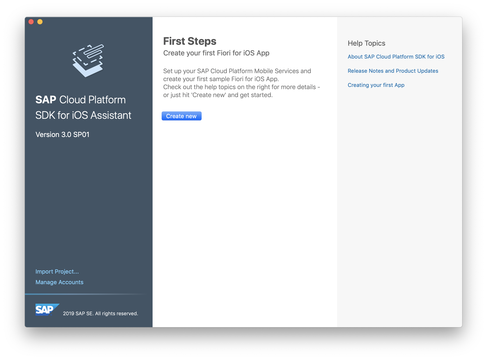

[DONE]
[ACCORDION-END]

[ACCORDION-BEGIN [Step 2: ](Create an Xcode Project)]

Click the **Sample Application** to create a mobile application that connects to a sample backend.

>The first step of the workflow asks you to choose whether to create a sample app, use an existing cloud app configuration, or create a new one.

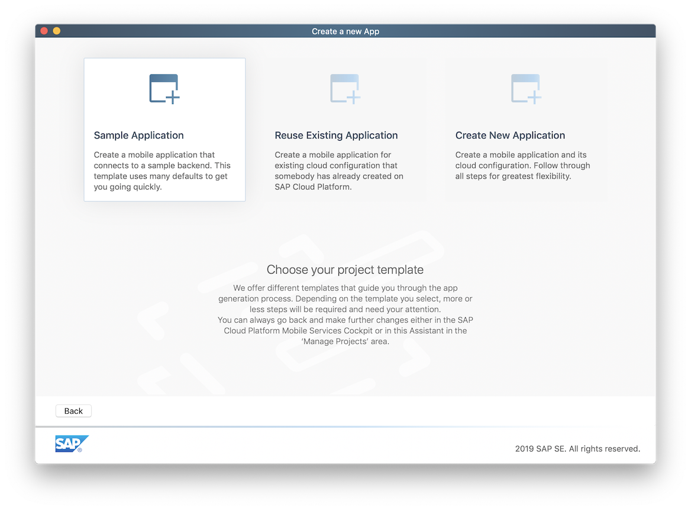

Select SAP Mobile Services account you added in previous tutorial and click **Next**.

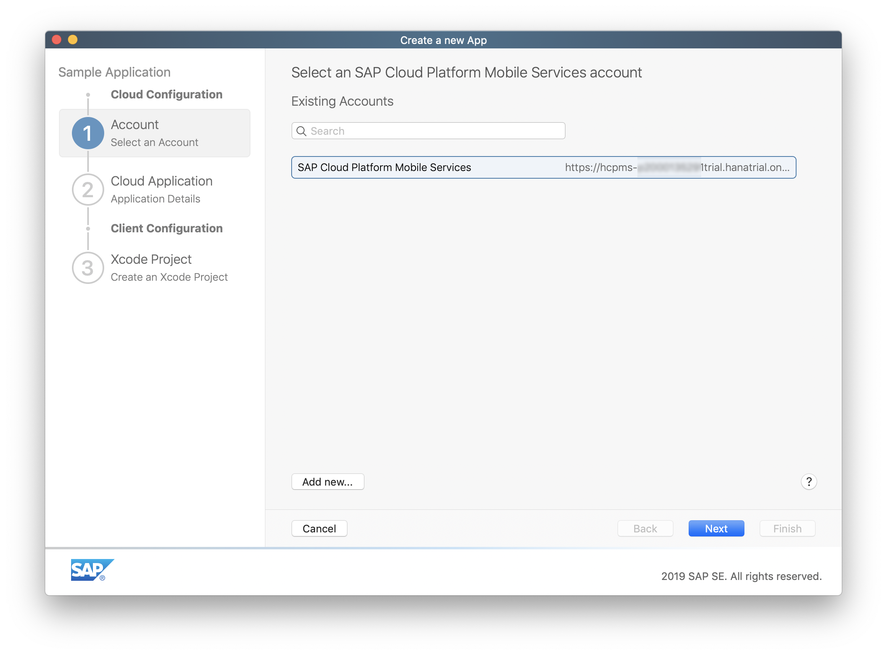

Provide application details to add application to SAP Mobile Services.

Enter the following details:

| Field | Value |
|----|----|
| Name | `SampleApp` |
| Identifier | `com.sap.sample` |

Provide the Xcode project configuration and click **Finish**.

| Field | Value |
|----|----|
| Product Name | `SampleApp` |
| Organization Name | `<your company name>` |
| Organization Identifier | `<a unique identifier>` |
| Path | `<choose a local destination>` |

[DONE]
[ACCORDION-END]

[ACCORDION-BEGIN [Step 3: ](Examine the generated application project and run the application)]

The SAP BTP SDK Assistant for iOS now takes a few seconds to generate the application project, and once finished, it will open **Xcode** with the generated application project.

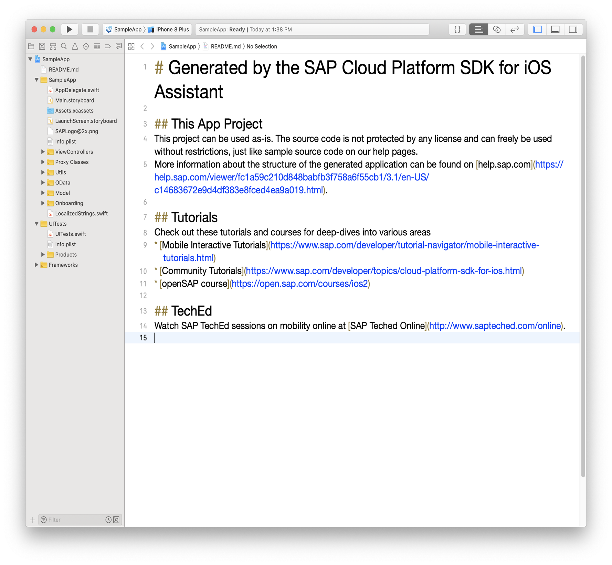

As you see, it has generated **Proxy Classes** for each entity of the specified OData service, generated **Views** and **View Controllers**, and tied them together in the `Main.storyboard` file as well as dedicated `<Entity>.storyboard` files in each `DemoProj/ViewControllers/<Entity>` folder.

Click the **Build and Run** button in Xcode.

The **Simulator** now starts up, and launches your application.

[DONE]
[ACCORDION-END]

[ACCORDION-BEGIN [Step 4: ](Prepare the app for first launch)]

Once finished loading, you are now presented the generated app's on-boarding screen:

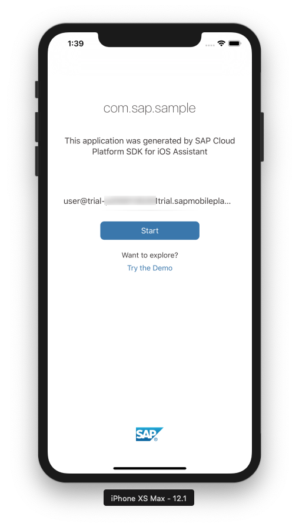

Click the blue **Start** button.

The **SAML** login screen of **SAP Mobile Services** is shown. Enter your login credentials for the SAP BTP and press the **Log On** button.

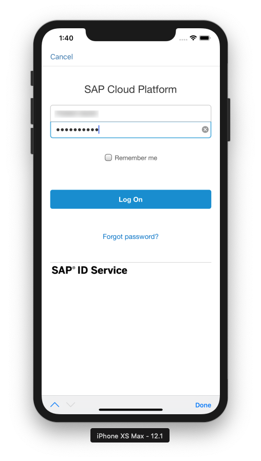

The app now displays the initial Data Privacy acknowledgement page. Tap **Allow** to proceed.

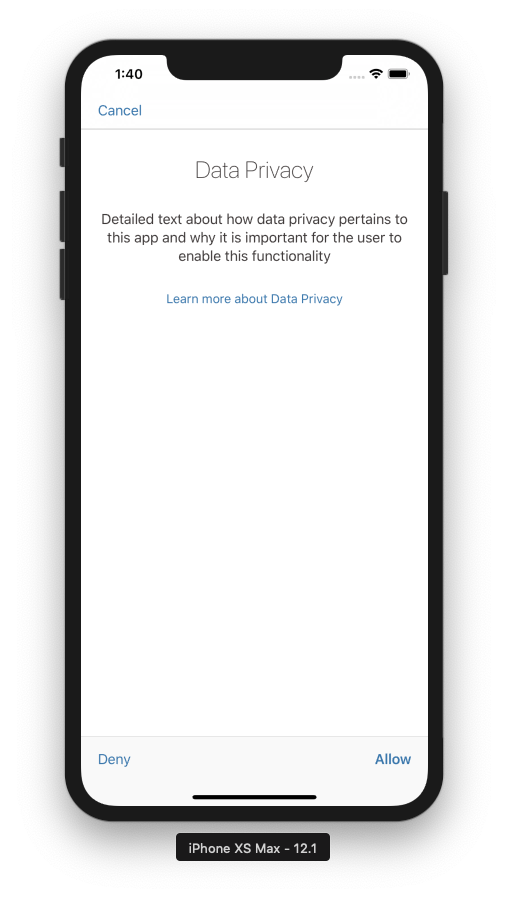

Now, you should provide a passcode with a minimum of 8 characters. Enter a numeric passcode.

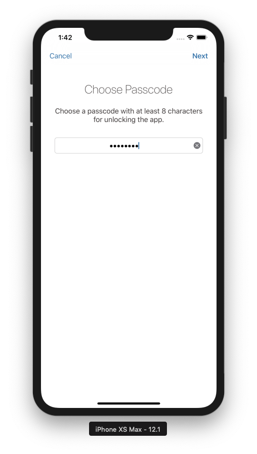

Tap **Next**, confirm the passcode, and click **Done**.

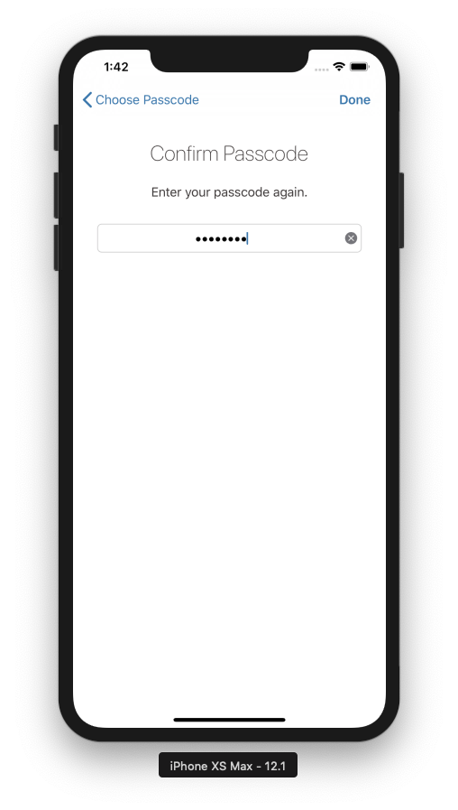

Now you will get a confirmation message asking permission to allow push notifications.

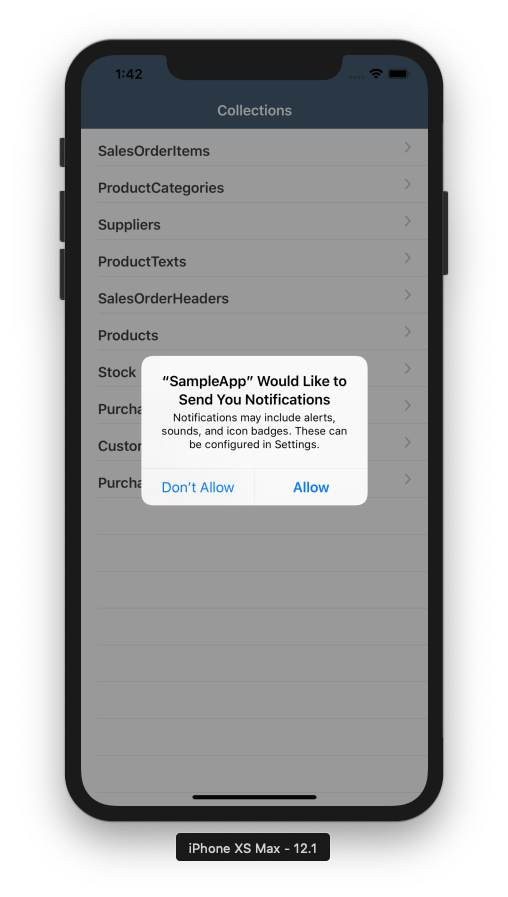

Click the Allow button to allow receiving of push notifications.

>If you run the app in the Simulator, you can select any option, since the simulator does not support receiving push notifications.

>If you run the app on a physical iOS device, it then stores your preference in the settings. You can change these preferences later in the iOS device by navigating to Settings > Notifications > Demo App and enable/disable notifications from here.

The app starts with an overview of the available **Collections** of the OData service.

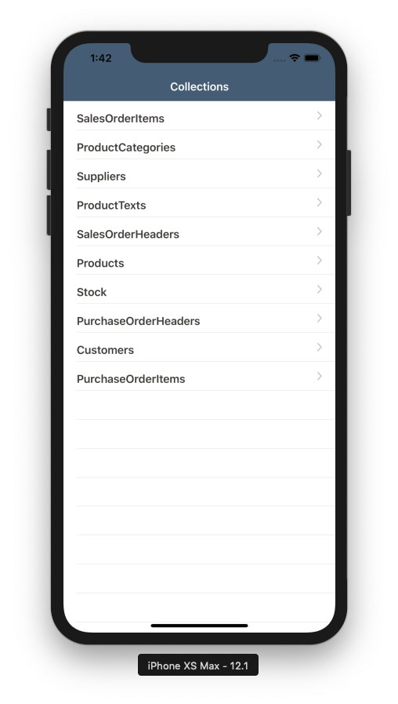

[DONE]
[ACCORDION-END]

