## Prerequisites
 - This tutorial is designed for SAP HANA service for SAP Business Technology Platform. Consider newer tutorials designed for SAP HANA Cloud.
 - You have created an instance of SAP HANA service for SAP BTP.
 - You are logged in to SAP Web IDE Full Stack and have [configured the access to the subaccount in SAP BTP, Cloud Foundry environment](webide-multi-cloud).
 - You have enabled the `SAP HANA Database Development tools` and `SAP HANA Database explorer` in the `Features` section in the settings for SAP Web IDE.
 - Optionally, you have [downloaded and setup the Command Line Interface for Cloud Foundry](cp-cf-download-cli).

>**This tutorial cannot be completed with a trial account.**

## Details
### You will learn
  - How to create a multi-target application with a database module in SAP Web IDE Full-Stack
  - How to create a columnar table using declarative SQL
  - How to load data for testing into a columnar table from a CSV file
  - How to access the database explorer to browse your tables, data and use SQL statements

---

[ACCORDION-BEGIN [Step 1: ](Create a new project from template)]

Click `File->New` and choose **Project from Template**.

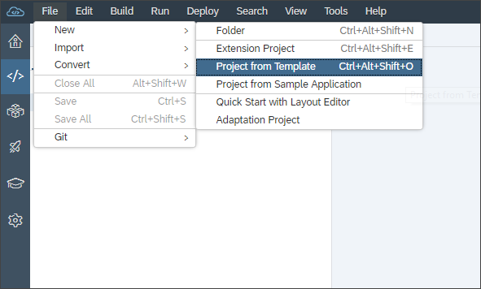

Choose **SAP HANA Database Application** and click **Next**.

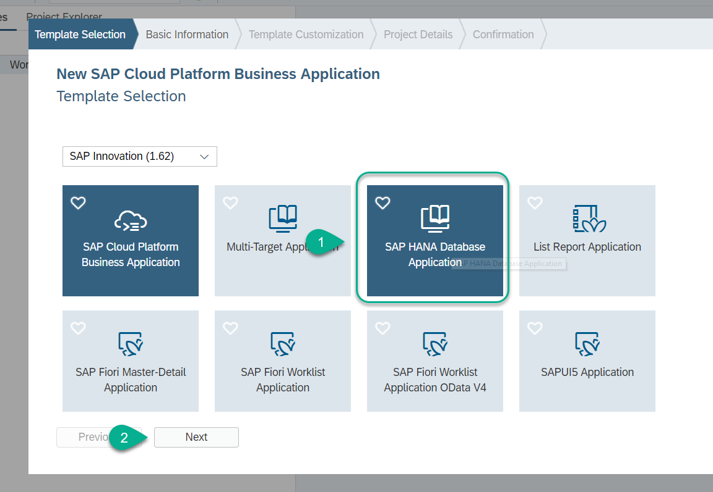

Call the project **DM** and click **Next**.

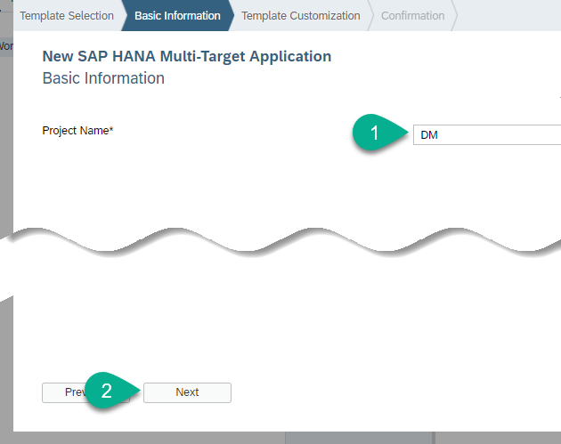

Remove the **namespace**


Choose version **2.0 SPS05** and click **Finish**


[DONE]
[ACCORDION-END]

[ACCORDION-BEGIN [Step 2: ](Create database artifacts)]

This project will combine artifacts from an HDI container and a classic, replicated schema.

You will first create a table to hold data from performance evaluations received by employees and the rating they give the company in terms of satisfaction.

These are sample records that will be stored in this table:


Right-click on the `src` folder, choose `New -> File`

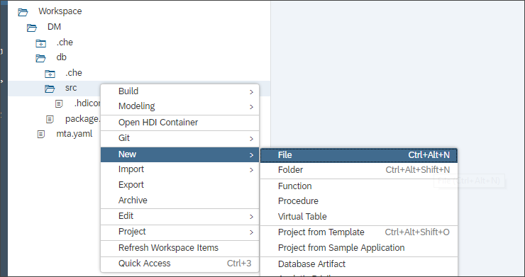

Use the following name

```Text
data/performance.hdbtable
```

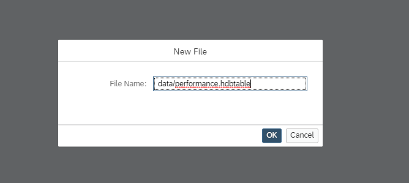

This will create both a folder and a file. Paste the following content into the `hdbtable` file to define a new table:

```sql
column table "PERFORMANCE" (
	"ID" INTEGER  unique not null COMMENT 'Employee ID',
	"EVALUATION_RATING" DOUBLE COMMENT 'Evaluation results',
	"REPORTS_TO" INTEGER not null COMMENT 'Reports to Manager',
	"FEEDBACK_COMMENT" NVARCHAR(512) COMMENT 'Feedback comment',
	"SATISFACTION_INDEX" DOUBLE COMMENT 'Employee given rating',
	PRIMARY KEY ("ID")
)
COMMENT 'Performance evaluation record'

```

**Save** the file.

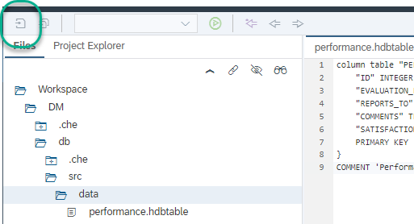

> **What is going on?**
> &nbsp;
> You have created a database module and a design time artifact representing a table. When this module is built, Web IDE will automatically create an HDI container and bind it as resource to the database module. It will also create the runtime object (a physical table) in the schema associated to the HDI container.
> &nbsp;
> This approach allows you to modify the structure of the table without worrying about underlying adaptation operations.

[DONE]
[ACCORDION-END]


[ACCORDION-BEGIN [Step 3: ](Create a text index)]

The table you have just defined will have a large text field with comments from the employees. You want to enable a text index to perform text search and mining operations.

Create a new database artifact under the data folder


Use the following name

```Text
comment_text
```


And choose `hdbfulltextindex`

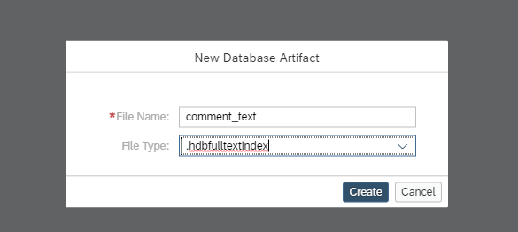


Paste the following code into it:

```sql
FULLTEXT INDEX "COMMENT_TEXT"
on "PERFORMANCE"("FEEDBACK_COMMENT")
FAST PREPROCESS OFF
TEXT ANALYSIS ON
```

**Save** the file.

[DONE]
[ACCORDION-END]

[ACCORDION-BEGIN [Step 4: ](Build the database module)]

You will be referring to this service later for integrations. For that reason, you will specify a name for the HDI container when it is created by SAP Web IDE.

Open the file `mta.yaml` on the `MTA Editor` tab.

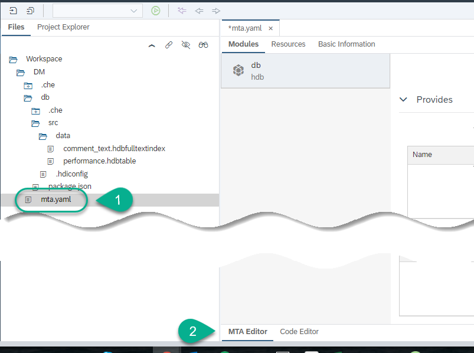

Open the **Resources** tab. Under **Parameters**, use the **+** sign to create the following key-value pair.

| key | Value |
|:------|:---------|
| `service-name` | `hana-hdi` |

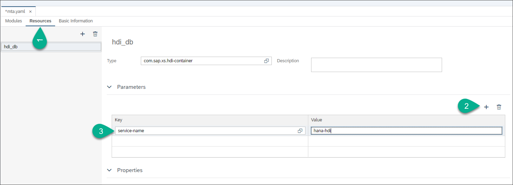

**Save** the file.

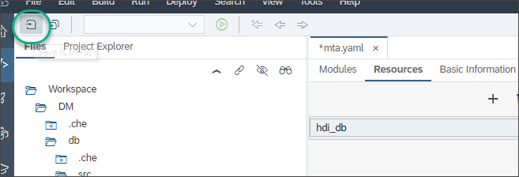

Right-click on the database module and choose **Build**.

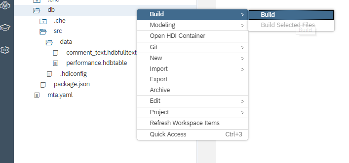

> **Getting an error?**
>
> If the build throws an error about the builder being outdated, right-click on the project and navigate into the Cloud Foundry menu. Make sure the settings are mapped to an instance of service of type `hana-db` and click **Reinstall Builder**. Once the builder is reinstalled, try the build again.

</br>
> **What is going on?**
>
>&nbsp;
> The console on the bottom will show the progress. First, an HDI container will be created and bound to the builder. Scroll up the log to see it in your screen:
>&nbsp;
>  
>&nbsp;
>  The container is called `hana-hdi`, which is the name you specified in the deployment configuration file, `mta.yaml`.
> If you continue to scroll down, you will see how the table and text index you have created using design-time artifacts are prepared for deployment.  A physical schema called `DM_HDI_DB_1` has been created. Finally, you will see a success message:
>
>&nbsp;
>
>  
>&nbsp;
> If you list the services using the CLI with command `cf services` or go into the services instances in your space in the SAP Cloud Platform Cockpit, you will see a new service bound to the Web IDE builder.
>&nbsp;
>  

[DONE]
[ACCORDION-END]

[ACCORDION-BEGIN [Step 5: ](Add data from a local file)]

For testing and development purposes, you can use a local file to load data into an HDI container.

Create the configuration for the upload first.  In the `data` folder, create a file called:

```Text
loads/dataload.hdbtabledata
```

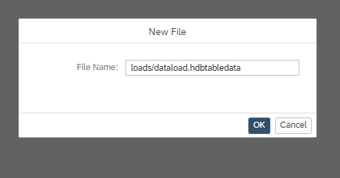

Paste the following content into it:

```sql
{
	"format_version": 1,
	"imports": [{
		"target_table": "PERFORMANCE",
		"source_data": {
			"data_type": "CSV",
			"file_name": "performance.csv",
			"has_header": true,
			"dialect": "HANA",
			"type_config": {
				"delimiter": ","
			}
		}
		}]
}		
```

Download this `csv` file -- `https://github.com/SAPDocuments/Tutorials/blob/master/tutorials/haas-dm-create-db-mta/performance.csv` into your computer. Upload it into the **loads** folder using the `Import` option


**Build** the **loads** folder

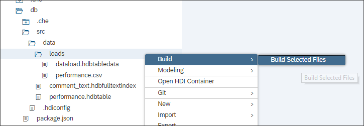

[DONE]
[ACCORDION-END]

[ACCORDION-BEGIN [Step 6: ](Check the data)]

Right click on the `db` module and choose **Open HDI Container**.

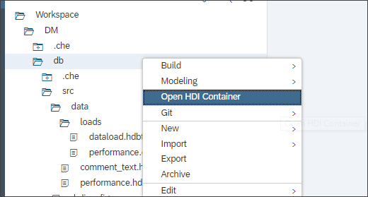

The editor will open the Database Explorer. Select **Tables**

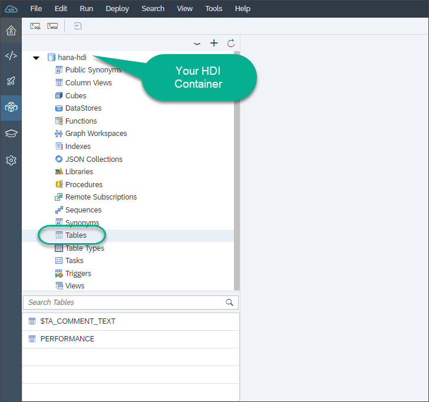

Right-click on the table **PERFORMANCE** and choose **Open Data**

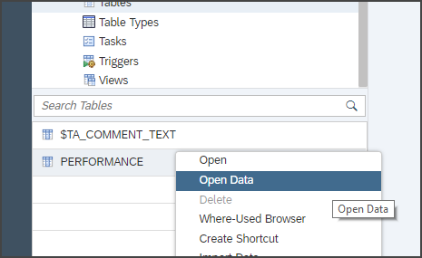

Open the **SQL editor** for this query


And execute the following SQL statement to complete the validation below:

```sql
SELECT AVG("SATISFACTION_INDEX")
FROM "DM_HDI_DB_1"."PERFORMANCE";
```

[VALIDATE_1]
[ACCORDION-END]


---
